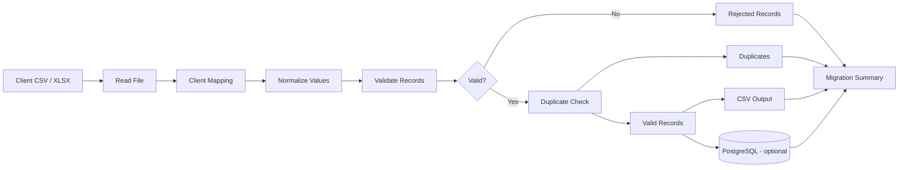

# Client Data Migration Engine

A configurable migration tool for client data that arrives in different CSV or Excel formats.

I created this project around a problem that I keep seeing in actual data work: the destination format is usually clear, but the source files are not. One client can send `First Name`, another can send `fname`, another can put the full name in one column, and date, phone, email and address formats can all be different.

The goal here is not to build something that magically guesses every possible file. I wanted a process that is controlled, repeatable and easy to check before anything is loaded into the destination.

## What this project does

The engine takes a client file, applies a client-specific mapping, normalizes the values, validates the records and separates anything that needs review.



The output is intentionally separated into:

- valid records
- rejected records with the reason
- possible duplicates
- migration summary
- optional PostgreSQL load

This means a bad row does not have to stop the full migration.

## Why I built it this way

The main issue I wanted to solve is consistency.

A common approach is to create a one-off script every time a new client sends a file. That works at first, but it becomes harder to maintain once the number of clients grows.

For this project, the migration logic is kept in the engine and most client-specific differences are kept in YAML configuration.

Example:

```yaml
client_name: client_a

column_mapping:
  Customer ID: customer_id
  First Name: first_name
  Last Name: last_name
  DOB: date_of_birth
  Mobile: phone
  Email Address: email
```

If another client uses a different layout, I can normally add another config instead of changing the core pipeline.

## Features

- CSV and XLSX input
- configurable column mapping
- case-insensitive source column matching
- required-column checks
- name cleanup
- flexible date parsing
- Philippine and international phone normalization
- email cleanup and validation
- duplicate detection
- rejected-row reporting
- JSON migration summary
- optional PostgreSQL load
- synthetic sample-data generator
- unit and integration tests
- GitHub Actions CI
- Docker Compose PostgreSQL for local testing

## Canonical customer schema

All client formats are converted into this structure:

| Field | Description |
| --- | --- |
| `customer_id` | Source customer identifier |
| `first_name` | First name |
| `last_name` | Last name |
| `date_of_birth` | ISO date when available |
| `phone` | Normalized phone number |
| `email` | Lowercase validated email |
| `address` | Street address |
| `city` | City |
| `state_province` | State / province |
| `postal_code` | Postal / ZIP code |
| `country` | Country |
| `source_system` | Client/source identifier |

## Project structure

```text
client-data-migration-engine/
|-- config/
|   `-- clients/
|       |-- client_a.yaml
|       |-- client_b.yaml
|       `-- client_c.yaml
|-- data/
|   `-- sample/
|       `-- README.md
|-- docs/
|   `-- architecture.md
|-- scripts/
|   `-- generate_sample_data.py
|-- sql/
|   `-- create_tables.sql
|-- src/
|   `-- migration_engine/
|       |-- __init__.py
|       |-- cli.py
|       |-- config.py
|       |-- db.py
|       |-- engine.py
|       |-- io.py
|       |-- normalizers.py
|       `-- validation.py
|-- tests/
|   |-- test_engine.py
|   `-- test_normalizers.py
|-- .env.example
|-- .gitignore
|-- docker-compose.yml
|-- Dockerfile
|-- Makefile
`-- pyproject.toml
```

## Sample data

I am not using any client data in this repository.

The sample files are generated using `Faker`, and the generator intentionally creates different schemas and introduces bad rows so the validation path can also be tested.

Generate the sample data:

```bash
python scripts/generate_sample_data.py --rows 1000
```

It will create:

```text
data/generated/client_a.csv
data/generated/client_b.xlsx
data/generated/client_c.csv
```

The generated data includes examples such as:

- duplicate records
- missing names
- invalid emails
- different date formats
- different phone formats
- extra whitespace

The point is to make the sample closer to the kind of files that need migration, instead of giving the engine perfectly clean data.

## Installation

Python 3.11+ is recommended.

```bash
git clone <repository-url>
cd client-data-migration-engine

python -m venv .venv
```

Windows:

```powershell
.venv\Scripts\activate
```

macOS/Linux:

```bash
source .venv/bin/activate
```

Install the project:

```bash
pip install -e ".[dev]"
```

## Run a migration

Generate sample files first:

```bash
python scripts/generate_sample_data.py --rows 1000
```

Run Client A:

```bash
migration-engine run \
  --input data/generated/client_a.csv \
  --config config/clients/client_a.yaml \
  --output output/client_a
```

Run Client B:

```bash
migration-engine run \
  --input data/generated/client_b.xlsx \
  --config config/clients/client_b.yaml \
  --output output/client_b
```

The output folder will contain:

```text
valid_records.csv
rejected_records.csv
duplicates.csv
migration_summary.json
```

Example summary from the default generated Client A sample:

```json
{
  "source_rows": 1001,
  "valid_rows": 994,
  "rejected_rows": 4,
  "duplicate_rows": 3,
  "loaded_to_database": 0
}
```

The exact numbers can change if the seed or number of generated records is changed.

## PostgreSQL

PostgreSQL is optional. The migration can run without a database.

Start the local database:

```bash
docker compose up -d postgres
```

Copy the environment file:

```bash
cp .env.example .env
```

Windows PowerShell:

```powershell
Copy-Item .env.example .env
```

Run the migration and load valid records:

```bash
migration-engine run \
  --input data/generated/client_a.csv \
  --config config/clients/client_a.yaml \
  --output output/client_a \
  --load-to-db
```

## Data quality rules

The current rules include:

- `customer_id` is required
- `first_name` is required
- `last_name` is required
- email must be valid when supplied
- phone must contain a usable number when supplied
- date of birth cannot be in the future
- duplicate matching uses normalized email and phone values

Rejected rows keep the original row number and rejection reason so they can be checked and corrected.

## Testing

Run:

```bash
pytest
```

The tests cover the parts that I consider easier to break during migration work:

- date normalization
- phone normalization
- email cleanup
- column mapping
- validation
- duplicate separation
- migration summary

## Engineering decisions

### Configuration instead of hardcoding each client

I wanted the core logic to stay stable. Client-specific headers belong in config unless there is a real transformation that needs code.

### Do not silently drop bad rows

A migration should be traceable. If a row is rejected, I want to know which row failed and why.

### Keep duplicate records separate

A duplicate is not always a bad record. Sometimes it needs a business decision, so the tool does not automatically delete all duplicates from history. It separates them for review.

### Controlled input is still better than trying to guess everything

The engine can handle different schemas, but I would still prefer giving users a standard XLSX template when that is possible. Configuration is useful for historical or external files where I do not control the format.

## Current limitations

This is the first portfolio version, so I intentionally kept the scope controlled.

Current limitations:

- full-name splitting is not included yet; the current schema expects first and last name fields
- address standardization is limited to whitespace cleanup
- duplicate matching is deterministic, not fuzzy
- database loading currently targets one canonical customer table
- no browser UI yet
- no automatic schema-mapping recommendation yet

## Improvements I would add next

- fuzzy duplicate matching
- configurable transformation plugins
- schema-mapping suggestions
- data profiling before migration
- migration run history
- row-level audit table
- S3 / Google Drive ingestion
- web interface for mapping and validation review
- chunked processing for very large files

## Portfolio note

This project is a sanitized portfolio implementation based on the type of data migration and cleanup problems I work with. All data included or generated here is synthetic.
