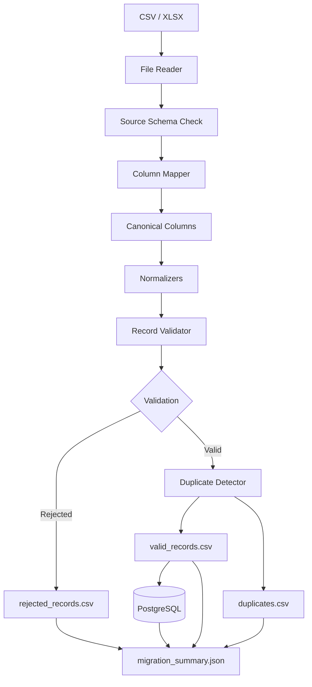

# Architecture

The project separates client-specific mapping from reusable migration logic.

## Main design rule

The engine should not need to know that one client calls a field `Mobile` while another calls it `contact_no`.

That difference belongs in the client configuration.

Code changes should mainly be needed when the actual transformation rule is different, not just because a header has another name.

## Flow

1. Read CSV/XLSX.
2. Normalize source headers for matching.
3. Confirm required source columns.
4. Apply the client mapping.
5. Add configured defaults.
6. Normalize canonical fields.
7. Validate each row.
8. Separate rejected records.
9. Detect duplicates from valid records.
10. Write outputs.
11. Optionally append valid records to PostgreSQL.
